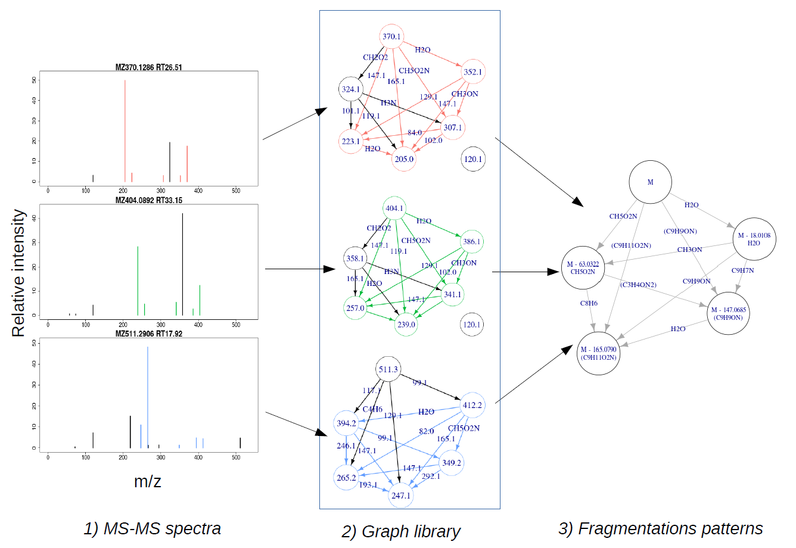

# The ***mineMS2*** R package:  Mining of MS/MS spectra by frequent subgraph mining to help structural interpretation

## Description

This package implements an algorithm to compute **fragmentation patterns** in a set of MS/MS spectra. These fragmentation patterns represent sets of **common mass differences** within subsets of spectra in the dataset. 

This algorithm takes as input a set of MS/MS spectra in *mgf* format and is composed of two main steps:

- every spectrum is represented by a graph, called *fragmentation graph*, containing the fragments of the spectrum and the mass differences between the fragments, when they comply with certain conditions.
- frequent subgraphs are searched among the fragmentation graphs, corresponding to sets of common mass differences

These two steps are summarized in the following figure:



It is then possible to compare these fragmentation patterns with GNPS network components or chemical families as illustrated in the following figure.


## Installation

The package can be installed from GitHub with:

```r 
#install.packages("devtools")
devtools::install_github("odisce/mineMS2")
```

## Basic use

More detailed examples are available in the vignettes.

### Input
The package needs spectra in *mgf* format as input. It is also possible to furnish supplementary information about the spectra (e.g. chemical formula, retention time, ...) in a *csv* file. 

```r
path_mgf <- system.file("dataset/dda_msms_pnordicum.mgf", package = "mineMS2")
supp_infos_path <- system.file("dataset/dda_msms_pnordicum_supp.csv", package = "mineMS2")
supp_infos <- read.table(supp_infos_path,header = TRUE, sep = ";", encoding = "utf-8", quote = "")
```

### Computing fragmentation patterns
An *ms2Lib* object is created, allowing to store the information about the spectra. 

```r
    m2l <- ms2Lib(path_mgf, suppInfos = supp_infos)
```

The two steps of the algorithm are computing with two dedicated functions. 

```r
        m2l <- discretizeMassLosses(m2l,
                            ppm = 15,
                            dmz = 0.007,
                            count = 2,)
        m2l <- mineClosedSubgraphs(m2l, count = 2, sizeMin = 1)
```

The fragmentation patterns are stored in the *ms2Lib* object in a *patterns* attribute. It is possible to vizualise information about a pattern (P1) with a plotting function. 

```r
    plotPatterns(m2l, "P1")
```

### Interpretation of GNPS components

A GNPS network on the same MS/MS data must be furnished in *graphml* format.

```r
    path_network <- system.file("dataset/graph_metgem_pverru.graphml", package = "mineMS2")

    net_gnps <- read_graph(path_network, "graphml")
```

The components of the network are then calculated and the patterns which maximize a chosen metric (such as F1-score, recall or precision) for every component are returned.

```r
components <- findGNPSComponents(net_gnps, minSize = 3, pairThreshold = 0.9)
patterns <- findPatternsExplainingComponents(m2l, components, metric = c("recall", "precision","size"), top = 1)
```
## Vignettes

Two vignettes provide detailed examples of mineMS2 use. 

The first vignette `main-minems2.Rmd` gives details on the different steps of the algorithms and shows how to plot and explore the resulting fragmentation patterns and mass differences. 

The second vignette `gnps-minems2.Rmd` shows how to use mineMS2 to explain GNPS components and gives some practical examples.


## Dataset

A dataset is furnished as an example in the *dataset* folder. It is composed of 52 spectra from an untargeted study [1] on the secondary metabolism of a species of fungi called *Penicillium verrucosum*.

The two vignettes use this dataset to present examples of results. 

## Citation

**mineMS2: Annotation of spectral libraries with exact fragmentation patterns**. Alexis Delabrière, Coline Gianfrotta, Sylvain Dechaumet, Annelaure Damont, Thaïs Hautbergue, Pierrick Roger, Emilien Jamin, Christophe Junot, François Fenaille, Etienne A. Thévenot

## Bibliography

[1] Thaïs Hautbergue, Olivier Puel, Souria Tadrist, Lauriane Meneghetti, Michel Péan, Marcel Delaforge, Laurent Debrauwer, Isabelle P. Oswald, et Emilien L. Jamin. **Evidencing 98 secondary metabolites of Penicillium verrucosum using substrate isotopic labeling and high-resolution mass spectrometry** . *Journal of Chromatography B*, Identification of molecules from non-targeted analysis, 1071 (2017): 29‑43. 
