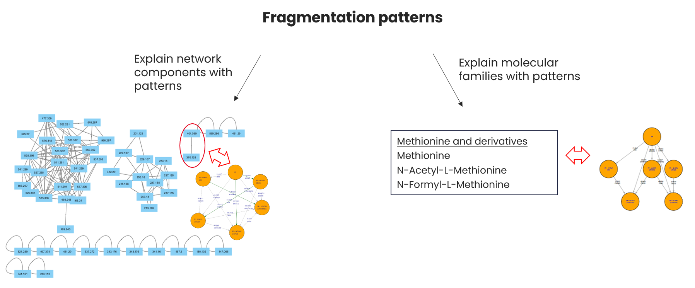

# mineMS2: Annotation of spectral libraries with exact fragmentation patterns

## Description

The search for similarities within a collection of MS/MS spectra is a powerful approach to facilitate the identification of new metabolites. mineMS2 implements an innovative strategy to extract frequent fragmentation patterns containing shared m/z differences between subsets of the spectra.

This package implements an algorithm to compute **fragmentation patterns** in a set of MS/MS spectra. These fragmentation patterns represent sets of **common m/z differences** within subsets of spectra in the dataset.

## Method

This algorithm takes as input a set of MS/MS spectra in *mgf* format and consists of two main steps (Figure 1):

1.  every spectrum is represented by a graph, called *fragmentation graph*, containing the fragments of the spectrum and the m/z differences between the fragments, when they comply with certain conditions.
2.  frequent subgraphs are searched among the fragmentation graphs, corresponding to sets of common m/z differences


Fig. 1:

It is then possible to compare these fragmentation patterns with GNPS network components or chemical families (Figure 2).



Fig. 2:

## Installation

The package can be installed from GitHub with:

``` r
#install.packages("devtools")
devtools::install_github("odisce/mineMS2")
```

## Getting started

More detailed examples are available in the vignettes.

### Input

The package takes as input an *mgf* file containing the collection of spectra. Additional metadata about the spectra (e.g. chemical formula, retention time, ...) may be provided as a supplementary *csv* file.

``` r
path_mgf <- system.file("dataset/dda_msms_pnordicum.mgf", package = "mineMS2")
supp_infos_path <- system.file("dataset/dda_msms_pnordicum_supp.csv", package = "mineMS2")
supp_infos <- read.table(supp_infos_path,header = TRUE, sep = ";", encoding = "utf-8", quote = "")
```

### Computing the fragmentation patterns

The *ms2Lib* object that will store the patterns is first initialized with the spectral data (and metadata):

``` r
library(mineMS2)
m2l <- ms2Lib(path_mgf, suppInfos = supp_infos)
```

The two steps of the algorithm are then applied to the *ms2Lib* object:

``` r
m2l <- discretizeMzDifferences(m2l, ppm = 15, dmz = 0.007, count = 2)
m2l <- mineClosedSubgraphs(m2l, count = 2, sizeMin = 1)
```

The computed fragmentation patterns are stored in the *patterns* slot of the *ms2Lib* object.

### Analyzing the patterns

The spectra, m/z differences, and patterns can be queried from the *ms2Lib* object, visualized, and exported with several methods including:

-   `mzDiffTable` : to get the list of all m/z differences in the MS/MS collection

-   `plot` :

-   `findMz` :

-   `select` :

-   `plotPatterns` :

It is possible to visualize information about a pattern (P1) with a plotting function.

``` r
plotPatterns(m2l, "P1")
```

For a more detailed description of the mineMS2 features, please see to the *mineMS2_main* vignette.

### Interpreting GNPS components

A GNPS network on the same MS/MS data must be included in the *graphml* format.

``` r
path_network <- system.file("dataset/graph_gnps_pnordicum.graphml", package = "mineMS2")
net_gnps <- read_graph(path_network, "graphml")
```

The components of the network are then calculated and the patterns which maximize a chosen metric (such as F1-score, recall or precision) for every component are returned.

``` r
components <- findGNPSComponents(net_gnps, minSize = 3, pairThreshold = 0.9)
patterns <- findPatternsExplainingComponents(m2l, components, metric = c("recall", "precision", "size"), top = 1)
```

## Vignettes

Two vignettes provide detailed examples of mineMS2 use.

-   `mineMS2_main.Rmd` gives details on the different steps of the algorithms and shows how to plot and explore the resulting fragmentation patterns and m/z differences.

-   `mineMS2_coupling-to-gnps.Rmd` shows how to use mineMS2 to explain GNPS components and gives some practical examples.

## Dataset

The included dataset, which is used in the examples and vignettes, consists of 51 spectra from the untargeted study of the secondary metabolism of *Penicillium nordicum* (Hautbergue *et al.*, 2019).

## Citation

**mineMS2: Annotation of spectral libraries with exact fragmentation patterns**. Alexis Delabrière, Coline Gianfrotta, Sylvain Dechaumet, Annelaure Damont, Thaïs Hautbergue, Pierrick Roger, Emilien Jamin, Christophe Junot, François Fenaille and Etienne A. Thévenot.

## Contacts

[alexis.delabriere\@hotmail.fr](mailto:alexis.delabriere@hotmail.fr), [coline.gianfrotta\@cea.fr](mailto:coline.gianfrotta@cea.fr), and [etienne.thevenot\@cea.fr](mailto:etienne.thevenot@cea.fr)

## References

Hautbergue,T. *et al.* (2019) Combination of isotope labeling and molecular networking of tandem mass spectrometry data to reveal 69 unknown metabolites produced by Penicillium nordicum. *Analytical Chemistry*. [DOI:10.1021/acs.analchem.9b01634](https://doi.org/10.1021/acs.analchem.9b01634).
